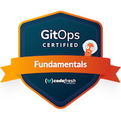
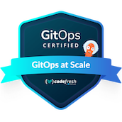

# Hi there 

## 👨 About me

Cloud Architect, {Dev/ML}Ops & Platform Engineer engineer with over `10 years of experience` designing and developing practical intelligent systems.

Enthusiastic about the DevOps culture and focused on Open Source technologies. My current focus is modern cloud infrastructure - I remove roadblocks and get teams back into productive flow.

Today I design highly automated, secure, and scalable cloud and container platforms that let development teams concentrate fully on their core product.

You can find more information about me on my personal site at [thatmlopsguy.github.io](https://thatmlopsguy.github.io).

## ☎️ Contact Methods

Feel free to [contact me](https://thatmlopsguy.github.io/contact/), and I will always get back to you. If we agree that I could help you, we can schedule a chat.

## 🏅 Certificates and Badges

## 🔓 Creator and maintainer of these projects

- [doKa-seca](https://github.com/thatmlopsguy/dokaseca-control-plane): framework for bootstrapping cloud-native platforms using Kubernetes in Docker (Kind)
- [github-k8s-operator](https://github.com/thatmlopsguy/github-k8s-operator): kubernetes operator for managing gitHub repositories (golang)
- [github-repo-operator-ansible](https://github.com/thatmlopsguy/github-repo-operator-ansible): kubernetes operator for managing gitHub repositories (ansible)
- [mkdocs-tech-radar](https://github.com/thatmlopsguy/mkdocs-tech-radar): MkDocs plugin that generates an interactive Technology Radar
- [asdf-argocd-image-updater](https://github.com/thatmlopsguy/asdf-argocd-image-updater): argocd-image-updater plugin for the asdf version manager
- [cookiecutter-ml-project](https://github.com/thatmlopsguy/cookiecutter-ml-project): blueprints for python based ML projects
- [pre-commit-hooks](https://github.com/thatmlopsguy/pre-commit-hooks): devops pre-commit git hooks

## 🔧 Tooling

### Languages

### Cloud

### Backend

### Databases & Messaging

### Machine Learning

### Other Tools

## 🌐 [Consulting Services](https://thatmlopsguy.github.io/consulting/)

I provide consulting to companies, teams, and projects of all sizes, helping them achieve technical excellence, high efficiency, and better human cohesion.
