# Hi there 

## 👨 About me

Cloud Architect, {Dev/ML}Ops & Platform Engineer with over `10 years of experience` building practical, production-ready intelligent systems.

A strong believer in GitOps and platform engineering, I work extensively with **ArgoCD** (including Events, Rollouts, and Workflows) and **Backstage** to empower developer self-service and streamline day-to-day operations.
I focus on cloud-native ecosystems, particularly around **Kubernetes**, observability, and cross-account infrastructure management, designing highly automated, secure, and scalable platforms that let development teams concentrate on their core product.

Passionate about **Open Source** and **Developer Experience (DevEx)**, I actively contribute to building scalable internal platforms that remove roadblocks and return teams to productive flow.

You can find more information about me on my personal site at [thatmlopsguy.github.io](https://thatmlopsguy.github.io).

## ☎️ Contact Methods

Feel free to [contact me](https://thatmlopsguy.github.io/contact/), and I will always get back to you. If we agree that I could help you, we can schedule a chat.

## 🏅 Certificates and Badges

<a href="https://www.virtualbadge.io/certificate-validator?credential=80f133bc-342d-4990-a696-d211a9e5e9d1" target="_blank" rel="noreferrer"> 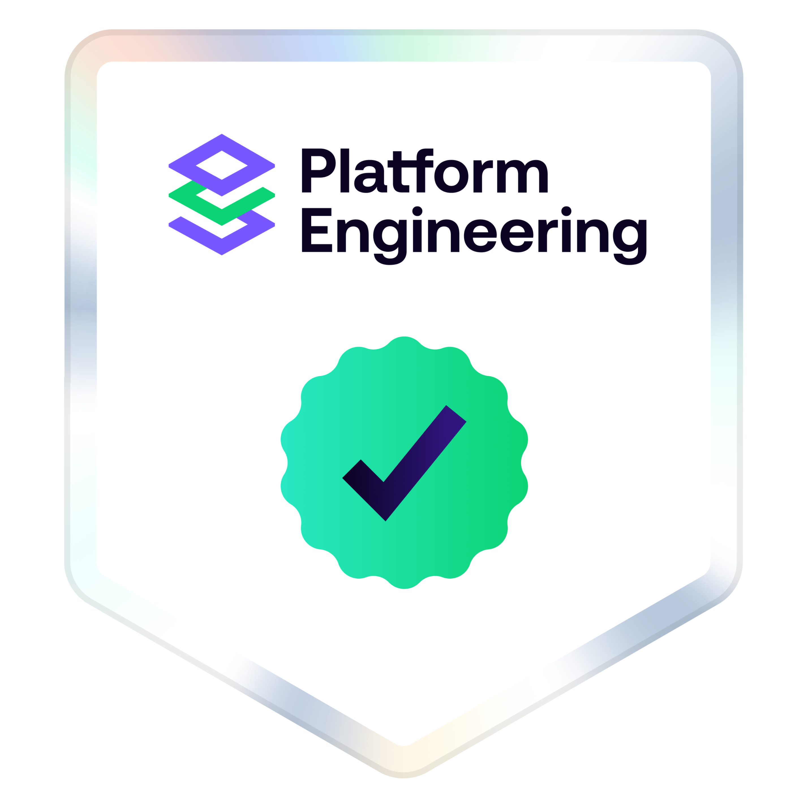</a>
<a href="https://www.virtualbadge.io/certificate-validator?credential=36855b34-c287-4167-beb2-298d9420063d" target="_blank" rel="noreferrer"> 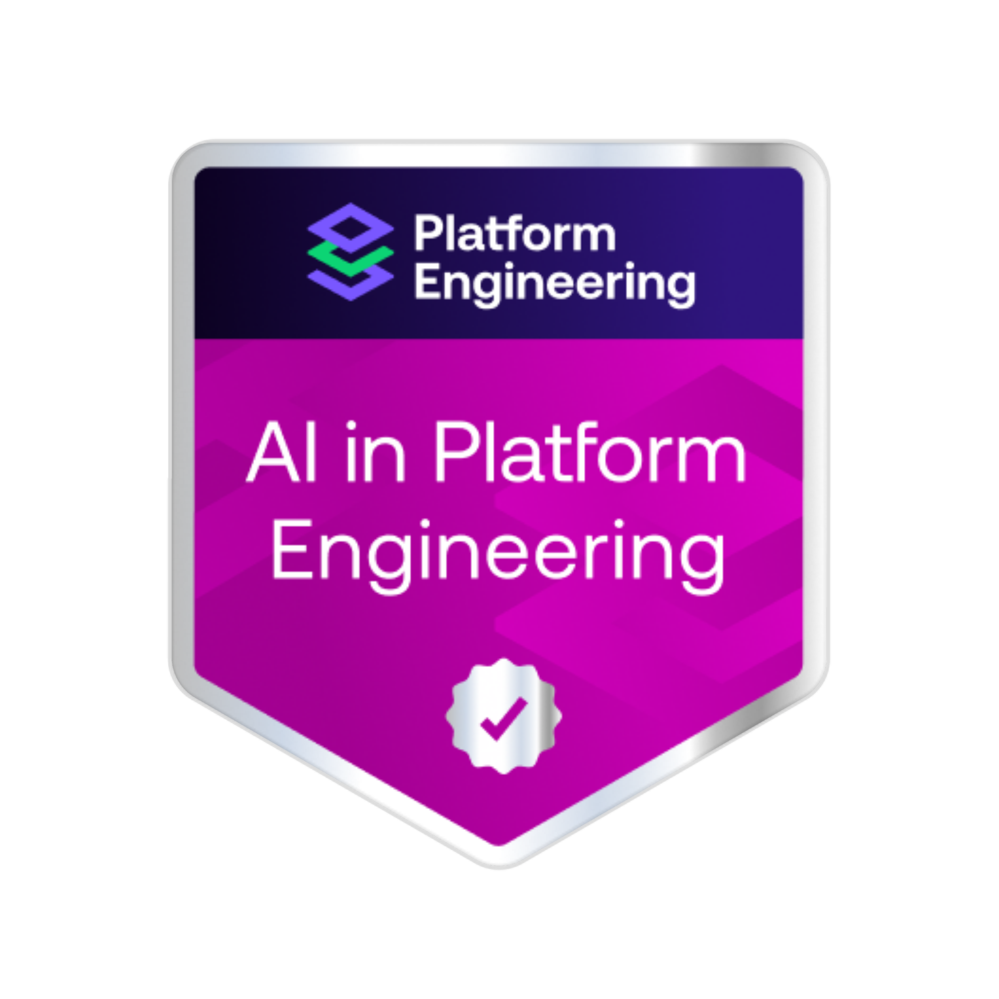</a>
<a href="https://www.virtualbadge.io/certificate-validator?credential=0ef3e631-2246-413e-8a0c-0359d65920bd" target="_blank" rel="noreferrer"> 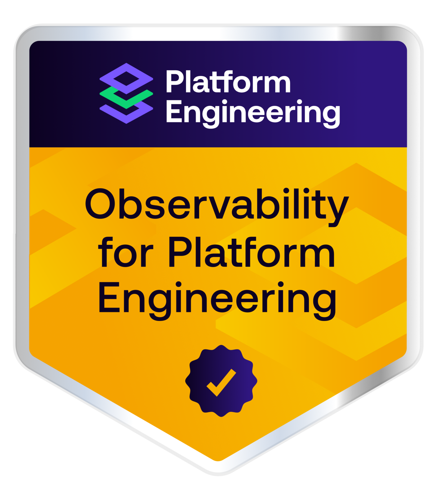</a>
<a href="https://www.virtualbadge.io/certificate-validator?credential=452dbcd6-77b3-49c3-a868-86bd80ce501f" target="_blank" rel="noreferrer"> 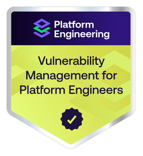</a>
<a href="https://www.virtualbadge.io/certificate-validator?credential=bd9f8dc9-3dfe-43c2-8f99-413772777097" target="_blank" rel="noreferrer"> 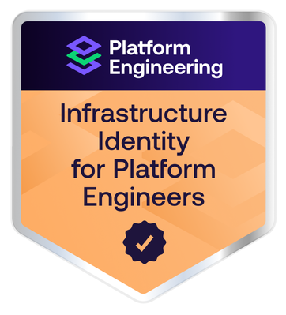</a>
<a href="https://www.virtualbadge.io/certificate-validator?credential=291fcf3e-19ad-45eb-891e-41cfdd60e50e" target="_blank" rel="noreferrer"> 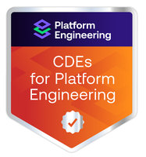</a>
<a href="https://www.virtualbadge.io/certificate-validator?credential=7b39a040-e2c3-4ec5-b406-fa0c514c0482" target="_blank" rel="noreferrer"> 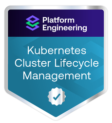</a>
<a href="https://www.credly.com/badges/726d0c60-e176-4f83-9812-e82f0374337a/public_url" target="_blank" rel="noreferrer"> 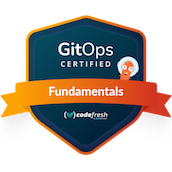</a>
<a href="https://www.credly.com/badges/00f3a021-a0ed-4363-a9e2-29d76d2ad9fb/public_url" target="_blank" rel="noreferrer"> 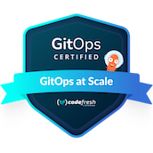</a>
<a href="https://www.credential.net/719ca7e1-c498-4e23-96f9-03215938c020" target="_blank" rel="noreferrer"> 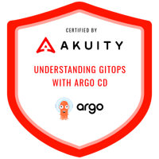</a>
<a href="https://academy.akuity.io/certificates/gyn6a8rxrd" target="_blank" rel="noreferrer"> 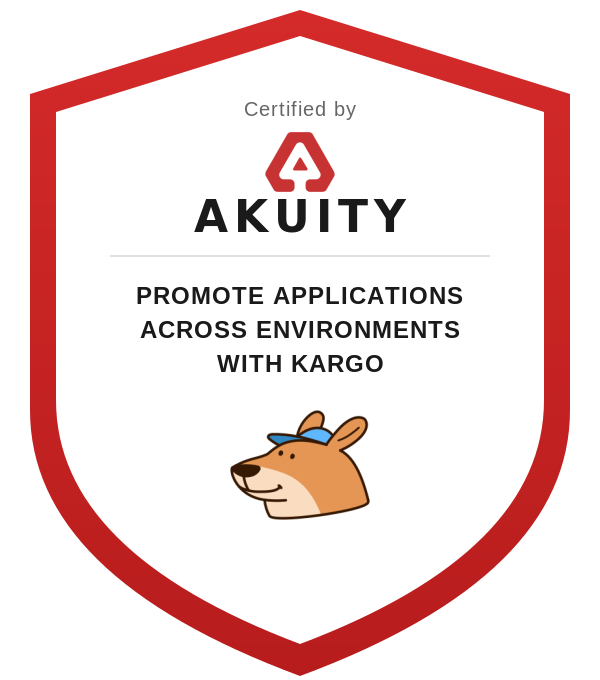</a>
<a href="https://www.credly.com/badges/6cb0c422-89f3-48d8-87c5-f7cf18a940cd/public_url" target="_blank" rel="noreferrer"> 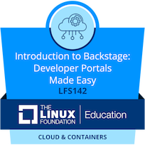</a>
<a href="https://www.credly.com/badges/d1738c92-40dd-4ffb-9b41-28efe653d148/public_url" target="_blank" rel="noreferrer"> 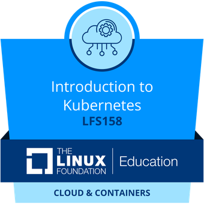</a>
<a href="https://www.credly.com/badges/13a0601e-9d73-4433-81f6-8954df9602d1/public_url" target="_blank" rel="noreferrer"> 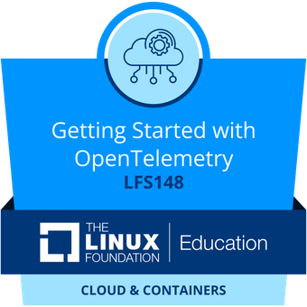</a>
<a href="https://www.credly.com/badges/2a3d76f2-015e-4caf-a348-dcb32201659b/public_url" target="_blank" rel="noreferrer"> 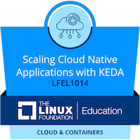</a>
<a href="https://www.credly.com/badges/b244e2a4-6a5b-46d9-9755-bfb8a66ef50c/public_url" target="_blank" rel="noreferrer"> 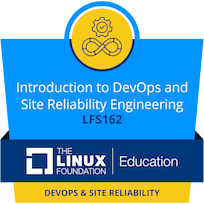</a>
<a href="https://www.credly.com/badges/2d68f567-0aa4-4fd9-a8e2-ea34eafe7834/public_url" target="_blank" rel="noreferrer"> 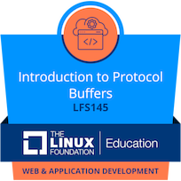</a>
<a href="https://www.credly.com/badges/28a91983-c672-44a0-8529-e85262a88f65/public_url" target="_blank" rel="noreferrer"> 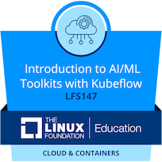</a>

<a href="https://www.credly.com/badges/d9d38d85-c31d-4dc6-bb16-da6345a99603/public_url" target="_blank" rel="noreferrer"> 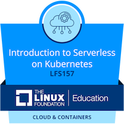</a>
<a href="https://www.credly.com/badges/44964227-7161-4522-be98-4569bb9dc957/public_url" target="_blank" rel="noreferrer"> 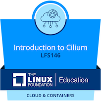</a>
<a href="https://www.credly.com/badges/ab0f2a31-3a6e-4860-b077-0b1929b2ceaf/public_url" target="_blank" rel="noreferrer"> 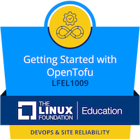</a>
<a href="https://www.credly.com/badges/5d3861aa-9f2f-4c15-a19f-21e12e0fbb69/public_url" target="_blank" rel="noreferrer"> 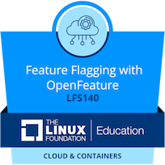</a>
<a href="https://www.credly.com/badges/abb6fc33-82b1-437c-be51-3e3ba2b41792/public_url" target="_blank" rel="noreferrer"> 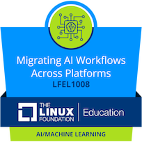</a>
<a href="https://www.credly.com/badges/92e15c56-825d-48c3-bc63-5de2f91bfca9/public_url" target="_blank" rel="noreferrer"> 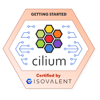</a>

## 🔓 Creator and maintainer of these projects

- [doKa-seca](https://github.com/thatmlopsguy/dokaseca-control-plane): framework for bootstrapping cloud-native platforms using Kubernetes in Docker (Kind)
- [github-k8s-operator](https://github.com/thatmlopsguy/github-k8s-operator): kubernetes operator for managing gitHub repositories (golang)
- [mkdocs-tech-radar](https://github.com/thatmlopsguy/mkdocs-tech-radar): MkDocs plugin that generates an interactive Technology Radarr
- [cookiecutter-ml-project](https://github.com/thatmlopsguy/cookiecutter-ml-project): blueprints for python based ML projects
- [pre-commit-hooks](https://github.com/thatmlopsguy/pre-commit-hooks): devops pre-commit git hooks
- [helm-charts](https://thatmlopsguy.github.io/helm-charts/): personal helm chart repository with charts for my projects and other useful tools
- [k8sResourceResizer](https://github.com/thatmlopsguy/k8sResourceResizer): GitOps/ArgoCD compatible tool for resizing kubernetes resource limits and requests based on historical usage patterns

## 🔧 Tech Stack

### Languages

### Cloud

### Backend

### Databases & Messaging

### Machine Learning

### Other Tools

## 🌐 Consulting Services

I provide consulting to companies, teams, and projects of all sizes, helping them achieve technical excellence, high efficiency, and better human cohesion.
See my [consulting page](https://thatmlopsguy.github.io/consulting/) for more details and to get in touch.

