

  

## 👨 About me

Cloud Architect, {Dev/ML}Ops & Platform Engineer with over `10 years of experience` managing cloud and on-premise
environments across AWS, Azure and GCP, as well as private clouds. Specializing in Kubernetes ecosystems, CI/CD
automation, GitOps practices, and AI/LLM infrastructure, including MLOps pipelines, RAG-based applications, and
multi-agent AI systems. Leveraging Generative AI tools to accelerate development, automate infrastructure, and improve
engineering productivity.

A strong believer in GitOps and platform engineering, passionate about creating seamless developer experiences
through modern platforms to empower developer self-service and streamline day-to-day operations.
I focus on cloud-native ecosystems, particularly around **Kubernetes**, observability, and cross-account infrastructure
management, designing highly automated, secure, and scalable platforms that let development teams concentrate on their
core product.

You can find more information about me on my personal site at [thatmlopsguy.github.io](https://thatmlopsguy.github.io).

## 📫 Contact

Feel free to [contact me](https://thatmlopsguy.github.io/contact/), and I will always get back to you.
If we agree that I could help you, we can schedule a chat.

## 🏅 Certificates and Badges

These are some of the certifications and badges I have earned over the years, demonstrating my expertise in various areas
of cloud architecture, platform engineering, and DevOps practices. You can click on each badge to verify its authenticity
and learn more about the skills and knowledge they represent. More badges and certificates can be found on my
[personal site](https://thatmlopsguy.github.io/certifications/).

| Organization | Badges |
| --- | --- |
| ClickHouse | <a href="https://www.credly.com/badges/4c0e84f1-5962-4a55-ae60-13446a81e074/public_url" target="_blank" rel="noreferrer"> 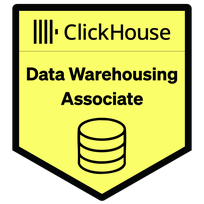</a>   |
| JFrog | <a href="https://www.credly.com/badges/02f421fb-1d4d-4fba-a20c-9bc6212f0cbc/public_url" target="_blank" rel="noreferrer"> 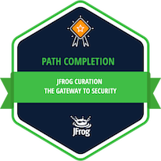</a> |
| Chainguard |   <a href="https://www.credly.com/badges/5964d43f-8411-41d7-ba92-bae0c10e06b5/public_url" target="_blank" rel="noreferrer"> 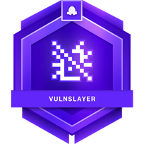</a> <a href="https://thatmlopsguy.github.io/certifications/" target="_blank" rel="noreferrer">See all (4) →</a> |
| Grafana Labs |   <a href="https://www.credly.com/badges/542bdd81-b010-418b-bd51-079723a6571c/public_url" target="_blank" rel="noreferrer"> 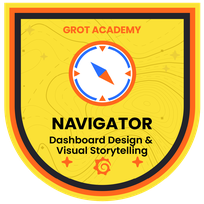</a> <a href="https://thatmlopsguy.github.io/certifications/" target="_blank" rel="noreferrer">See all (6) →</a> |
| PagerDuty |   |
| Datadog | <a href="https://www.credly.com/badges/03689aac-fd45-4034-9358-5411baf9eaeb/public_url" target="_blank" rel="noreferrer"> 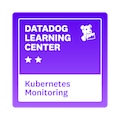</a>   <a href="https://thatmlopsguy.github.io/certifications/" target="_blank" rel="noreferrer">See all (4) →</a> |
| Platform Engineering | <a href="https://www.virtualbadge.io/certificate-validator?credential=f97514ac-3890-4076-a856-7a6004ad0bf1" target="_blank" rel="noreferrer"> 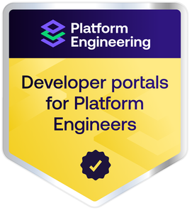</a>  <a href="https://www.virtualbadge.io/certificate-validator?credential=0ef3e631-2246-413e-8a0c-0359d65920bd" target="_blank" rel="noreferrer"> 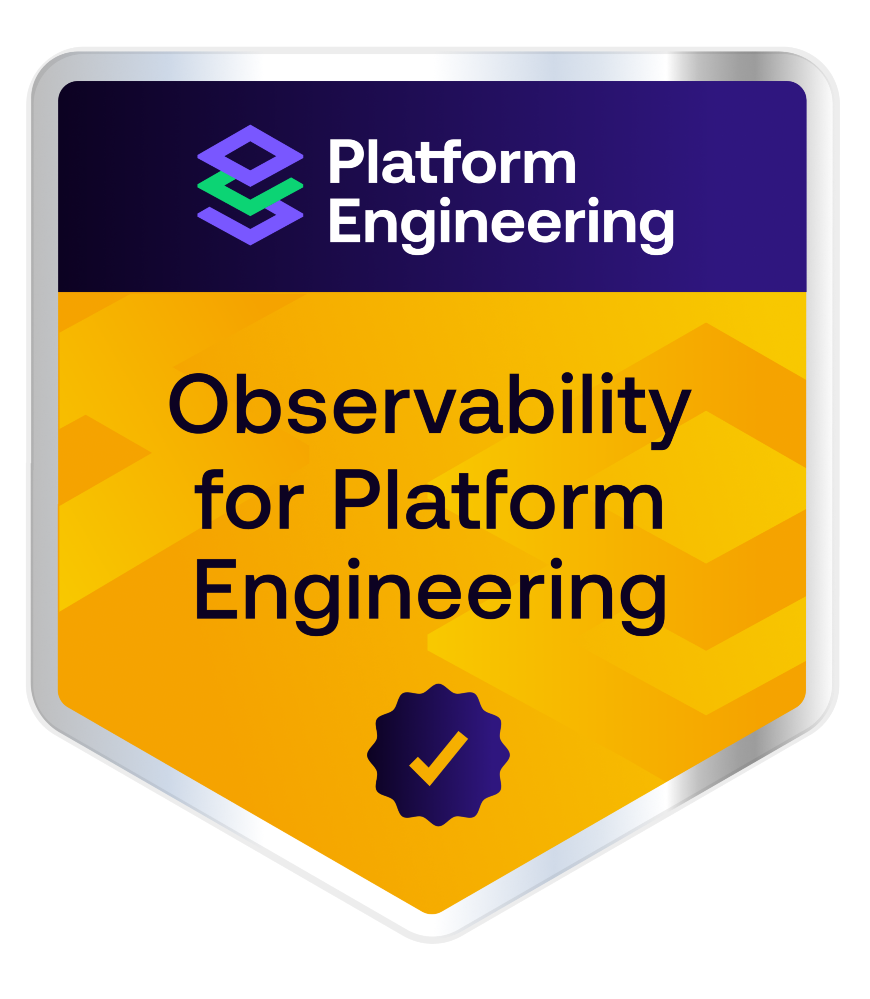</a> <a href="https://thatmlopsguy.github.io/certifications/" target="_blank" rel="noreferrer">See all (9) →</a> |
| Codefresh | <a href="https://www.credly.com/badges/726d0c60-e176-4f83-9812-e82f0374337a/public_url" target="_blank" rel="noreferrer"> 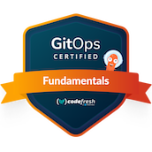</a> <a href="https://www.credly.com/badges/00f3a021-a0ed-4363-a9e2-29d76d2ad9fb/public_url" target="_blank" rel="noreferrer"> 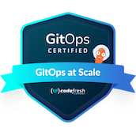</a> |
| Akuity |  <a href="https://academy.akuity.io/certificates/gyn6a8rxrd" target="_blank" rel="noreferrer"> 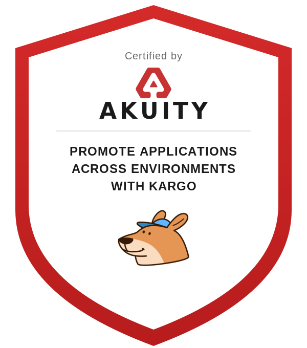</a> |
| The Linux Foundation | <a href="https://www.credly.com/badges/6cb0c422-89f3-48d8-87c5-f7cf18a940cd/public_url" target="_blank" rel="noreferrer"> 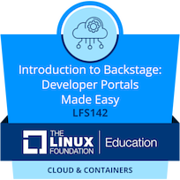</a> <a href="https://www.credly.com/badges/d1738c92-40dd-4ffb-9b41-28efe653d148/public_url" target="_blank" rel="noreferrer"> 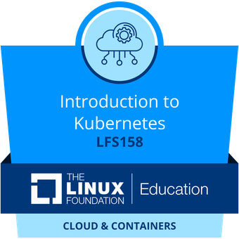</a> <a href="https://www.credly.com/badges/13a0601e-9d73-4433-81f6-8954df9602d1/public_url" target="_blank" rel="noreferrer"> 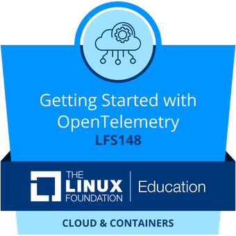</a> <a href="https://thatmlopsguy.github.io/certifications/" target="_blank" rel="noreferrer">See all (25) →</a> |
| Isovalent | <a href="https://www.credly.com/badges/56b36477-1c66-412c-aef1-d9c453a0bb98/public_url" target="_blank" rel="noreferrer"> 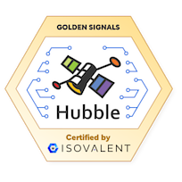</a>   <a href="https://thatmlopsguy.github.io/certifications/" target="_blank" rel="noreferrer">See all (35) →</a> |

## 🔓 Creator and maintainer of these projects

- [doKa-seca](https://github.com/thatmlopsguy/dokaseca-control-plane): framework for bootstrapping cloud-native platforms using Kubernetes in Docker (Kind)
- [github-k8s-operator](https://github.com/thatmlopsguy/github-k8s-operator): kubernetes operator for managing gitHub repositories (golang)
- [mkdocs-tech-radar](https://github.com/thatmlopsguy/mkdocs-tech-radar): MkDocs plugin that generates an interactive Technology Radar
- [cookiecutter-ml-project](https://github.com/thatmlopsguy/cookiecutter-ml-project): blueprints for python based ML projects
- [pre-commit-hooks](https://github.com/thatmlopsguy/pre-commit-hooks): devops pre-commit git hooks
- [helm-charts](https://thatmlopsguy.github.io/helm-charts/): personal helm chart repository with charts for my projects and other useful tools
- [k8sResourceResizer](https://github.com/thatmlopsguy/k8sResourceResizer): GitOps/ArgoCD compatible tool for resizing kubernetes resource limits and requests based on historical usage patterns

## 🔧 Tech Stack

### Languages

### Cloud

### Backend

### Databases & Messaging

### Machine Learning

### Other Tools

